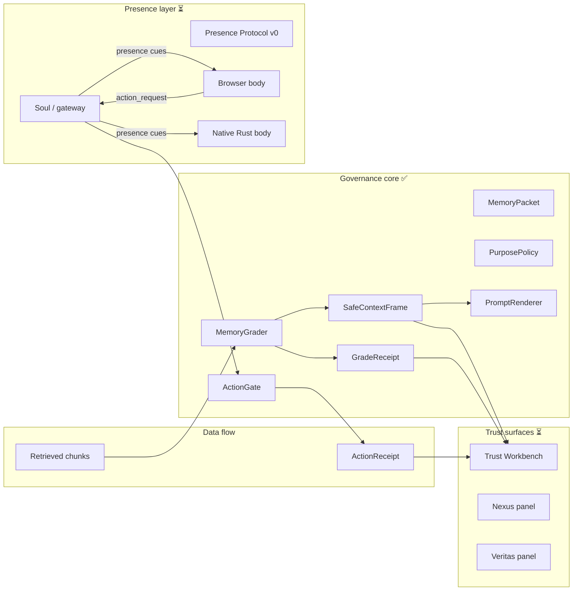

# Border Agents — What It Is, What It Could Be

**Roundtable report · June 2026 · `presence-layer` branch**

---

## One sentence

Border Agents is a visible governance layer for AI work — miniature companions at the edge of your screen that make trust boundaries inspectable *before* retrieved knowledge becomes memory, claims, actions, or shared artifacts.

It is **not** a general agent framework, a chat wrapper, or another “smart overlay.” The bet is narrower and harder: prove that **similarity is not authority**, then make that proof feel delightful enough that people actually use it.

---

## The problem it targets

Every AI system today conflates three things:

1. **Retrieval** — “this chunk is relevant”
2. **Authorization** — “this chunk may be used *for this purpose*”
3. **Action** — “the agent may now do something in the world”

Most products stop at (1). Border Agents insists on (2) and (3) as **deterministic, receipted decisions** — with the LLM suggesting metadata, never deciding trust.

> *A system can possess knowledge without being authorized to act upon it.*

That principle is the product.

---

## What’s actually built (honest inventory)

The repo is two halves on the `presence-layer` branch, **recently joined** for the first time:



### 1. Governance core — proven (v0.1 complete)

This is the trust-critical heart. Literal names, deterministic logic, **150 tests green**.

| Primitive | Role |
|-----------|------|
| `MemoryGrader` | Grades retrieved chunks into `trusted` / `limited` / `reference_only` / `blocked` / `quarantined` |
| `SafeContextFrame` | Preserves *every* retrieved chunk — nothing is silently dropped |
| `PromptRenderer` | Purpose-aware rendering (`clean` / `annotated` / `strict`) |
| `GradeReceipt` | Machine-readable derivation trail for every grade |
| `userPosture` | Work / Play / Private postures that can only **tighten** trust, never widen it |

The core demo works today:

```text
same retrieved chunks + different purposes = different SafeContextFrames
```

Run `npm run demo:trace` to see Hermes memory graded differently for `summarize_history`, `answer_current_policy`, `agent_action`, and `external_share`.

### 2. Action governance — just landed (June 13, 2026)

The memory grader now has an action-side mirror:

| Deliverable | Location / proof |
|-------------|------------------|
| `authorizeEffectorAction` | `src/core/actionGate.ts` — deterministic gate for buddy effectors |
| `ActionReceipt` | Same derivation-trail shape as `GradeReceipt` |
| Presence protocol extension | `action_request` / `action_result` cues |
| First live effector | `receipt_review` (read-only, `reach` kind — opens the ledger, doesn’t replace the real tool) |
| E2E proof | Playwright: Veritas `/review` → `needs_confirmation` → Confirm → `allow` + ledger (`e2e/governance-action.spec.ts`) |

This is the milestone that matters: **a buddy action now produces a receipt**, joining presence to governance.

### 3. Presence layer — real, not mocked (steps 1–3 done; step 4 in flight)

The soul/body split is architectural, not metaphorical:

| Layer | Role | Status |
|-------|------|--------|
| **Soul** | Reasons, decides, acts. Routes effectors through Core Patrol. | `scripts/soul-server.ts` (`npm run soul:dev`) + TS handlers; dev gateway is relay-only |
| **Body** | Dumb puppet. Renders position, emotion, speech. Never reads or acts on screen. | Browser + native Rust |

**Delivered:**

- **Presence Protocol v0** — typed, versioned schema (`src/presenceProtocol.ts`); ~8 soul→body cues, ~9 body→soul events
- **Native desktop body** — pure Rust on `wlr-layer-shell`, software-rendered (no GTK/WebKit/GPU). Animated face, speech bubble, menu, drag-stable, click-through, multi-monitor
- **Experimental window pinning** on COSMIC — Hermes can attach to a tracked native window as a small head; presentation-only, not control
- **Browser body + Tauri panel host** — settings, Trust Workbench, dock chrome
- **Wizard onboarding** — scripted setup soul for connect / posture / place

**Step 4 largely done (2026-06-13 pm):** `scripts/soul-server.ts` runs the real action gate over WebSocket with a file-backed ledger — native body gets the same `needs_confirmation` → Confirm → `allow` round-trip as the browser. On-body Review/Confirm button added (compile + layout test; live COSMIC click pending manual verify). Remaining: Wizard Act 0 host, one real `act` effector behind the gate.

### 4. Trust Workbench + buddy UX — scaffolded (v0.2)

- Nexus shows retrieval grades, blocked counts, source list
- Veritas shows warnings, evidence-ready items, expandable receipt rows
- Shared `TrustWorkbenchPanel` across browser preview and buddy surfaces
- Docked vs. undocked speech bubble behavior, persisted placement state
- `ActionReceiptCard` for the new action flow

The chrome is live and polished. Receipt export and real source opening are still TODO. Native Review/Confirm affordance is wired; dock ledger summary for action entries is not.

---

## What it is *not* (yet)

The roadmap is explicit about what’s out of scope until the primitive is proven:

- Full multi-agent runtime
- Real vector DB integrations (mock Hermes memory only)
- Artifact lifecycle (Nova), code/action borders (Forge)
- Custom agent marketplace, cloud auth, payments
- LLM-based authorization decisions

This discipline is a feature. `AGENTS.md` warns against expanding into a general agent framework before memory grading is proven.

---

## The pitch — why this could matter

### The wedge is correct

Memory grading is the right first primitive because every downstream AI failure traces back to the same mistake: **treating relevance as permission**. Border Agents makes that crossing visible:

- Expired policy docs don’t become “trusted context” for current-policy answers
- Chunks without `may_use_for_action` can’t influence `agent_action`
- Blocked chunks stay in the ledger — inspectable, not erased
- Every grade and every action emits a receipt

That’s an audit trail and a UX surface, not a vibe check.

### The UX strategy is differentiated

Most “AI safety” products are dashboards developers tolerate. Border Agents bets the opposite:

> **Make reliability feel good.**

Miniature characters (Nexus, Veritas, Forge, Nova…) peek from screen edges. They bob, glance, and surface governance outcomes in speech bubbles. Work / Play / Private postures lower *friction*, not *trust*. The goal is addictive inspectability — you *want* to tap the owl when a claim needs evidence.

If they pull this off, they get something rare: **consumer-grade delight on enterprise-grade determinism**.

### The architecture scales if they stay disciplined

Three structural choices create real optionality:

1. **Soul/body split + presence protocol** — port a body by implementing ~14 events, not re-building a runtime. Same soul drives browser extension, desktop overlay, phone, kinetic body.

2. **Bodies present; souls act** — screen read/write are governed soul effectors, never body capabilities. This keeps the trust core deterministic and bodies portable. It’s the right security boundary for computer-use agents.

3. **Reach vs. act effectors** — buddies *open* real tools (`reach`) by default; direct action (`act`) requires heavier gates. They’re building an inspection layer, not trying to replace Codex / Claude / Grok.

### The market position is unoccupied

| Competitor angle | Border Agents angle |
|-----------------|---------------------|
| “Smarter retrieval” | Retrieval preserved; **authorization graded** |
| “Agent does it for you” | Agent **asks**, shows receipt, you confirm |
| “Trust the model” | Trust the **policy + provenance + receipt** |
| “Another chat UI” | **Edge-native presence** at trust boundaries |

They sit *between* vector search and prompt context — and eventually between intent and action. That’s a layer no one owns yet.

---

## What it could be — potential if handled correctly

### Near term (6–12 months): the inspectable AI companion

If they finish Step 4 (Rust body ↔ soul wire) and harden the Trust Workbench:

- **Demo that sells:** same memory, four purposes, four different frames — visible on a buddy head, not a terminal
- **Developer wedge:** drop-in governance for any agent that already retrieves memory
- **Personal wedge:** one trustworthy owl (Veritas) that won’t let claims slip without evidence

Success metric: people run the buddies daily because receipts are *faster* than guessing whether the model hallucinated policy.

### Medium term: the trust OS for AI work

If they resist framework creep and extend grading to artifacts and actions:

- **Nova** — governed artifact packaging (hash, version, export bundle)
- **Forge** — tool calls, file writes, code diffs behind approval receipts
- **Core Patrol** — full default team, user-configurable, all receipt-producing

This becomes the **governance shell** around whatever LLM or agent platform you already pay for. Connectors, not replacement.

### Long term: platform for scoped agents

v1.0 vision — custom Border Agents by signed manifest:

- Declared borders, triggers, allowed/forbidden actions
- Team policy templates
- Rule: *custom agents may add inspection and escalation; they may not bypass governance*

That’s an enterprise moat: **signed, auditable agent contracts** with a consumer-friendly face.

---

## Risks — the ways it fails

1. **Cute mascots without governance depth** — if the buddies become decoration, it’s a screensaver with an owl. The action gate landing is the antidote, but `receipt_review` is the *only* live effector and it is read-only (`reach`). **The single thing the next milestone must attack:** put one real `act` effector behind the gate and prove a hard block holds against a tool that could actually do harm. That converts “very good demo” into “infrastructure.”

2. **Governance without UX** — if Trust Workbench stays developer-only, nobody sees the receipts. The presence layer exists to prevent this.

3. **Framework creep** — building runtime, marketplace, and auth before the grading primitive has real users. `AGENTS.md` knows this; execution must match.

4. **Platform fragility** — the native body depends on Wayland / `wlr-layer-shell`. Window pinning is COSMIC-specific today. The protocol mitigates this (bodies are swappable), but desktop parity is work.

5. **Soul still mostly scripted** — the dev gateway is a stand-in. Real value requires wiring to actual LLM / agent runtimes while keeping authorization in the deterministic core.

6. **Core correct, call site wrong** — a deterministic core with 150 green unit tests does not imply wired surfaces call it correctly. Example found 2026-06-13: the dock addressed Veritas by persona id (`owl`); the gate keyed grants by governance id (`veritas`); real `/review` silently fell through to `blocked/ungranted` while tests (hardcoded `"veritas"`) stayed green. Fixed via `resolveManifestId`. **Every new effector and every new body is another seam like that** — each must graduate from core unit tests to integration tests against the real surface.

---

## Bottom line

**Today, Border Agents is:** a working deterministic governance core (memory grading + action gating + receipts), a real native presence body wired to a real soul server over WebSocket, a browser / Tauri UX shell, and end-to-end proof that a buddy action produces an inspectable `ActionReceipt` on **both** browser (Playwright) and native (soul round-trip + on-body button) — **154 tests, Playwright-guarded.**

**Tomorrow, if handled correctly, it becomes:** the visible trust boundary for AI — where retrieval stops being permission, actions stop being silent, and safety stops being something you configure in a settings panel nobody opens.

The pitch isn’t “AI agents on your desktop.” It’s:

> **Your AI already found it. Border Agents decides what it’s allowed to become — and shows you the receipt.**

That’s a category worth building. The repo is far enough along that it’s no longer vapor — but still early enough that the next six months of discipline (wire the soul, ship real effectors, don’t build a framework) determine whether it becomes infrastructure or a very good demo.

---

## Reviewer notes · 2026-06-13 (Claude Opus, post-merge)

Grounded in the code as merged to `main` this session, not the prose above.

**What's load-bearing-true.** The thesis lives in the implementation, not just the pitch: `authorizeEffectorAction` mirrors `GradeReceipt`'s derivation trail exactly, so "similarity is not authority" is the literal shape of the code. The honest inventory *is* honest — dev gateway is a stand-in, Step 4 isn't wired, the browser is the proof path; all three verified. And one market-table row graduated from bet to fact this session: "agent asks → shows receipt → you confirm" now runs end-to-end (`e2e/governance-action.spec.ts`).

**Where the prose runs a half-step ahead.** `receipt_review` is the *only* live effector and it is read-only (`reach`). The gate's hard-block paths are unit-tested but have never been exercised against an `act` effector that could actually do harm. "A buddy action produces a receipt" is true; "the gate holds under pressure" is not yet proven.

**A live instance of Risk #5, found this session.** The dock addressed Veritas by persona id (`owl`); the gate keyed grants by governance id (`veritas`); the *real* `/review` silently fell through to `blocked/ungranted` while unit tests (hardcoded `"veritas"`) stayed green. Fixed via `resolveManifestId`. The lesson generalizes: **a correct core does not imply correct call sites.** Every body and every effector is another seam like that — promote each from core unit tests to integration tests against the real surface.

**Highest-leverage next move.** Not more mascots, not more panels: **put one real `act` effector behind the gate and prove a hard block holds against a tool that could cause harm.** That single demo is what converts "very good demo" into "infrastructure."

---

## Open structural question — which body is the product? (for the roundtable)

The soul/body split makes this less either/or than it feels, but the *investment* question is real and unresolved.

- **Browser buddies** — run on every device (laptop, phone, non-COSMIC desktops), lowest friction, already the governance proof path and the Playwright harness. Ceiling: webview / overlay limits (see `docs/OVERLAY_POSTMORTEM_AND_REBUILD_PLAN.md`) — closer to a docked panel than true ambient edge presence.
- **Native COSMIC body** — pure-Rust `wlr-layer-shell`: click-through, drag-stable, window-pinning, Review/Confirm affordance. True edge-native ambient presence, and the only path with headroom for "mature rendering." Cost: COSMIC / Wayland-only, platform-fragile. Now runs governance actions via `soul:dev` — live COSMIC click still needs manual verify before calling parity complete.

They serve different jobs, and the architecture was built for both to coexist on one soul. The framing for the room:

1. **The soul is the product; bodies are render targets. Never fork the soul.** Whatever is decided, governance / routing / effectors / memory stay single-sourced.
2. **"Both, connected" is the design, not a hedge** — but it is blocked on **finishing Step 4**. Until the Rust body runs the same live soul as the browser (gate, receipts, provider routes), you cannot run them side by side or make a fair flagship call. Parity-on-protocol is the unlock; reach it *before* anointing a flagship.
3. **Then split roles deliberately:** browser = portability + test harness + away-from-desk; native = COSMIC daily-driver flagship where the "mature rendering" investment goes. The vision of *all intelligent instances at the screen edge, one per provider* points at the native body — webview overlays don't do persistent ambient presence cleanly.
4. **That multi-instance vision is already modeled** (buddy manifest roster: Hermes/Grok, Claw/Codex, Veritas/Claude, Nexus/OpenRouter). The blocker is finishing the bodies and wiring real provider routes — not the architecture. Hardware caps the count; nothing else does.

The trap to name for the room: **parallel bodies double the wire-compatibility surface, and the native one is platform-fragile.** The mitigant already exists (protocol + cross-language golden fixtures); the discipline is that no body ever grows logic. The persona-id bug above is the cautionary tale of what "thin body, fat soul" costs the moment a seam is missed.

### Recommended build order (if the roundtable asks "what do we do Monday?")

Don't pick. Don't fork the soul. Keep all intelligence single-sourced.

| Order | Move | Why |
|-------|------|-----|
| 1 | **Finish Step 4** — native body on the live protocol with governance parity | Highest leverage on the board; makes "both in parallel" the actual design instead of a hedge |
| 2 | **Invest rendering polish in the native body** | Where "mature rendering" belongs; the overlay postmortem proved webview can't follow |
| 3 | **Keep the browser body deliberately plain** | Reach and reliability, not beauty — plus the Playwright harness |
| 4 | **One real `act` effector + surface integration test** | Proves the gate under pressure; closes the seam gap (Risk #6) |

Once the wire is finished, the fork disappears: you stop developing "a browser product" or "a native product" and start developing the soul, which both inherit. "Which to develop" becomes "which do I open each morning" — native on COSMIC for ambient edge presence; browser everywhere else.

---

## Session update · 2026-06-13 (pm)

Closed the gap named in the reviewer notes: **governance parity over the wire.**

| Deliverable | Proof |
|-------------|-------|
| `scripts/soul-server.ts` (`npm run soul:dev`) | Real `handleActionRequest` over WebSocket; file-backed ledger; replaces gateway stub for actions |
| `parseActionCommand` | Shared `/review` / `/confirm` parsing for browser + native bodies (154 vitest) |
| Native Review/Confirm button | `desktop-body/`: emits `action_request`, flips on `needs_confirmation`; 31 cargo tests (+ layout regression) |

**Honesty boundary:** soul round-trip and body→soul builder are tested; the actual on-screen COSMIC click was not verified headlessly in this session.

**Next after merge:** manual COSMIC verify → one real `act` effector + hard-block proof → dock action ledger entries → Wizard Act 0.

---

## References

| Doc | Purpose |
|-----|---------|
| [AGENTS.md](AGENTS.md) | Project stance, non-negotiable laws |
| [docs/ROADMAP.md](docs/ROADMAP.md) | v0.1–v1.0 build order and current status |
| [docs/ARCHITECTURE.md](docs/ARCHITECTURE.md) | Core data flow and UI mapping |
| [docs/SPEC_MEMORY_GRADING.md](docs/SPEC_MEMORY_GRADING.md) | Memory grading primitive spec |
| [docs/CORE_PATROL.md](docs/CORE_PATROL.md) | Default agent roster and borders guarded |
| [README.md](README.md) | Run instructions and product framing |
| [docs/STEP4_WIRE_THE_SOUL_PLAN.md](docs/STEP4_WIRE_THE_SOUL_PLAN.md) | Native body ↔ soul wire — current status and plan |